# ⚽ GoalBet — Autonomous World Cup Prediction Market on X Layer


> **Autonomous AI Agent Delegation** · **Dynamic Parimutuel Pooling** · **100% On-Chain SVG NFT Receipts**  
> Deployed on **OKX X Layer Mainnet** for the **Build-X Hackathon: X Cup 2026** (May 19–28).

🌐 **Live DApp**: [GoalBet Web App (Local Host)](http://localhost:3000)  
🛠️ **Developer Profile**: Built by **[Ritesh59697](https://github.com/Ritesh59697)**  
⚡ **Powered by**: **OKX X Layer** & **Ethers.js**

---

## 🌟 Introduction & Value Proposition

GoalBet is a decentralized, peer-to-peer prediction market designed specifically for the World Cup 2026. Built on OKX's high-speed, low-cost L2 network **X Layer**, GoalBet introduces two groundbreaking innovations to the prediction market space:

1. **Parimutuel Odds Pricing**: Unlike fixed-odds prediction markets (like Polymarket) where users bet against a market maker or an orderbook, GoalBet pools all bets together. Odds adjust dynamically in real-time based on the pool sizes. Winner takes all (minus a tiny 2% protocol fee).
2. **Autonomous AI Agent Delegation**: Users can safely delegate betting authority to a built-in AI agent (`GoalBetAgent`). By defining a budget and authorizing the agent, users can sit back while the AI calculates expected value (EV) and places mathematically optimized wagers using the **Kelly Criterion**.

---

## 🏗️ Architecture Overview

The repository is organized into a Hardhat-based smart contract environment and a modern Next.js client application with an embedded autonomous agent.

```
GoalBet/
├── contracts/
│   ├── PredictionMarket.sol   ← Core parimutuel betting contract & escrow pool logic
│   ├── BetReceiptNFT.sol      ← On-chain SVG NFT receipt creator (ERC-721)
│   └── MockUSDT.sol           ← ERC-20 Mock USDT for testing/local networks
├── scripts/
│   ├── deploy.js              ← Deployment script (mainnet / testnet / local)
│   ├── create-match.js        ← Dev/Admin utility: Create matches on-chain
│   └── test-rpc.js            ← Dev utility: Verify RPC block query capabilities
├── frontend/                  ← Next.js Web App
│   ├── src/
│   │   ├── agent/             ← GoalBetAgent.js (AI agent client-side code)
│   │   ├── app/               ← Next.js routing, layout & pages
│   │   ├── hooks/             ← Contract hooks (useMatches, useUSDT, useAgent)
│   │   └── utils/             ← Config, ABIs, and network settings
│   └── globals.css            ← CSS styling system (responsive, glassmorphic, dual-theme)
├── hardhat.config.js          ← Hardhat compilation & X Layer configuration
└── package.json               ← Project dependencies and scripts
```

### AI Agent Delegation Flow

```mermaid
sequenceDiagram
    autonumber
    actor User as User Wallet
    participant Contract as PredictionMarket (On-Chain)
    participant Agent as GoalBetAgent (Client/Node)

    User->>Contract: authorizeMyAgent(agentAddress, budget)
    Note over User,Contract: Budget USDT is safely escrowed in contract

    loop Match Analysis
        Agent->>Contract: getMatch() & getOdds()
        Contract-->>Agent: Pools, kickoff, teams
        Agent->>Agent: Run Kelly Criterion (FIFA ratings + odds EV)
    end

    rect rgb(30, 30, 46)
        Note over Agent,Contract: Executing Delegated Bet
        Agent->>Contract: agentPlaceBet(userAddress, matchIndex, outcome, amount)
        Contract->>Contract: Validate agent & user budget limits
        Contract->>Contract: Deduct budget & update parimutuel pool
        Contract->>User: Mint 100% On-Chain SVG NFT Receipt
    end
```



---

## 🚀 Live Mainnet Deployments

GoalBet is fully deployed and verified on the **OKX X Layer Mainnet**.

| Contract | Address | Explorer Link |
|---|---|---|
| **PredictionMarket** | `0x12114397DCD0A58E10ff4eeb1d55c58558849dC7` | [Verify on OKLink](https://www.oklink.com/x-layer/address/0x12114397DCD0A58E10ff4eeb1d55c58558849dC7) |
| **BetReceiptNFT** | `0x6afb09487F7b3C5826976fFE1f3b851bD7aec75D` | [Verify on OKLink](https://www.oklink.com/x-layer/address/0x6afb09487F7b3C5826976fFE1f3b851bD7aec75D) |
| **Tether USD (USDT)** | `0x1E4a5963aBFD975d8c9021ce480b42188849D41d` | [Verify on OKLink](https://www.oklink.com/x-layer/token/0x1E4a5963aBFD975d8c9021ce480b42188849D41d) |

---

## ⚽ Features & Core Innovations

### 1. Parimutuel Pool Odds Pricing
Traditional sports betting relies on bookmakers set with static odds, extracting massive vigs. GoalBet operates via **on-chain parimutuel pooling**. All USDT wagers for a match are consolidated into a single pool.
* **On-Chain Formula**:
  $$\text{Outcome Odds} = \frac{\text{Total Pool} \times (1 - \text{Platform Fee})}{\text{Outcome Pool}}$$
* Platform Fee is set to a minimal `2%` inside `PredictionMarket.sol`, with the remaining `98%` paid back directly to winning participants.
* Odds update dynamically with every wager, reflecting the wisdom of the crowd.

### 2. Autonomous AI Betting Agent (`GoalBetAgent`)
Users can delegate prediction duties to our autonomous AI. 
* **Escrow Security**: The agent never gains access to the user's private key. The user escrows a specified budget of USDT inside the `PredictionMarket` contract and registers the agent. The agent can only execute `agentPlaceBet()` using the escrowed budget.
* **Revocability**: Users can update their agent's budget or revoke authorization instantly, returning escrowed USDT to their wallet.

### 3. Kelly Criterion Betting Engine
The client-side `GoalBetAgent` evaluates sports matches using the **Kelly Criterion**, a mathematical formula designed to maximize the logarithmic growth of capital:
$$f^* = \frac{p \cdot b - q}{b} = p - \frac{q}{b}$$
*Where:*
* $p$ is the estimated probability of winning (calculated dynamically from FIFA team strength ratings and form).
* $q$ is the probability of losing ($1 - p$).
* $b$ is the decimal odds minus 1.
* $f^*$ is the fraction of the budget to bet.

#### Risk Profiles
Users choose from three risk configurations, which apply a multiplier to $f^*$ (fractional Kelly) to safeguard bankroll:
* **Conservative**: $0.25 \times$ Kelly multiplier (Min confidence: $70\%$, Max wager: $5\%$)
* **Moderate**: $0.5 \times$ Kelly multiplier (Min confidence: $55\%$, Max wager: $10\%$)
* **Aggressive**: $1.0 \times$ Kelly multiplier (Min confidence: $40\%$, Max wager: $20\%$)

### 4. 100% On-Chain SVG NFT Receipts
Upon placing a bet (manually or via agent), the contract mints a **Bet Receipt NFT** to the user.
* **Metadata & SVG Generator**: The vector image (SVG), traits, match details, and prediction parameters are generated entirely on-chain in Solidity using `Base64` and `Strings`.
* **Zero External Dependencies**: No IPFS, Arweave, or centralized servers. The receipt is permanently stored, rendered, and verifiable on X Layer.

### 5. Multi-RPC Resiliency Switcher
To guarantee maximum uptime and avoid single-point RPC failures during high-traffic hackathon testing, the Next.js frontend implements an **Automatic RPC Fallback Switcher** that detects latency spikes and rotates RPC endpoints dynamically.

---

## 🛠️ Quick Start & Local Setup

### Prerequisites
* Node.js v18+
* Hardhat
* MetaMask or similar Web3 Wallet

### 1. Install Dependencies
```bash
# Install root/hardhat dependencies
npm install

# Install frontend next.js dependencies
cd frontend && npm install
cd ..
```

### 2. Configure Environment Variables
Create a `frontend/.env.local` file:
```env
NEXT_PUBLIC_NETWORK=mainnet
NEXT_PUBLIC_MARKET_ADDRESS=0x12114397DCD0A58E10ff4eeb1d55c58558849dC7
NEXT_PUBLIC_NFT_ADDRESS=0x6afb09487F7b3C5826976fFE1f3b851bD7aec75D
NEXT_PUBLIC_USDT_ADDRESS=0x1E4a5963aBFD975d8c9021ce480b42188849D41d
NEXT_PUBLIC_RPC_URL=https://rpc.xlayer.tech
NEXT_PUBLIC_AGENT_ADDRESS=0x1be21172bEaD8F5FE43435f0eEd93b186cba06B6

# Private keys for agent-execution (if running the AI bot locally)
AGENT_PRIVATE_KEY=your_agent_wallet_private_key
PRIVATE_KEY=your_wallet_private_key
NEXT_PUBLIC_CRON_SECRET=goalbet_secret_key
```

Create a root `.env` file:
```env
PRIVATE_KEY=your_deployer_wallet_private_key
USDT_ADDRESS=0x1E4a5963aBFD975d8c9021ce480b42188849D41d
OKLINK_API_KEY=your_oklink_api_key
```

### 3. Run DApp Locally
```bash
cd frontend
npm run dev
```
Open [http://localhost:3000](http://localhost:3000) to view the DApp.

---

## 🔧 Hardhat Tasks & Utility Scripts

### Compiling contracts
```bash
npx hardhat compile
```

### Deploying to local network (with mock USDT)
```bash
# Start local node
npx hardhat node

# Run deployment script
npx hardhat run deploy.js --network localhost
```

### Creating On-Chain Matches
Use the match creator script to publish new matches directly on-chain:
```bash
# Batch mode (prompts you to create a pre-configured list of matches)
npx hardhat run scripts/create-match.js --network xlayer

# Custom match creation via env variables
HOME_TEAM="Brazil" AWAY_TEAM="Germany" MATCH_ID="WC2026_010" KICKOFF_HOURS=48 npx hardhat run scripts/create-match.js --network xlayer
```

### RPC Connectivity Check
Run the utility script to verify query filtering capabilities of the X Layer RPC:
```bash
node scripts/test-rpc.js
```

---

## 🏆 Hackathon Submission Checklist

* [x] **Smart Contracts verified on OKLink**
* [x] **2% Protocol Fees escrowed, with remaining 98% paid out directly to winner pools**
* [x] **AI Agent with mathematically sound Kelly Criterion risk-sizing**
* [x] **On-chain ERC-721 SVG NFT generator**
* [x] **Responsive and interactive UI featuring Light & Dark glassmorphic modes**
* [x] **Resilient RPC Fallback Integration**

---

*Developed by **[Ritesh59697](https://github.com/Ritesh59697)** for the X Cup Hackathon 2026. Good luck to all teams!*
