# ⚽️ GoalBet - Autonomous World Cup Prediction Market on X Layer

> **Autonomous AI Agent Delegation** · **Dynamic Parimutuel Pooling** · **100% On-Chain SVG NFT Receipts**
> Deployed on **OKX X Layer Mainnet** for the **Build-X Hackathon: X Cup 2026** (May 19–28).

**Live DApp**: https://goal-bet-kappa.vercel.app/
**Demo Video**: [Watch Demo on YouTube](https://youtu.be/0Y1j5FxqVJY)
**Developer**: [Ritesh59697](https://github.com/Ritesh59697)
**Powered by**: OKX X Layer & Ethers.js

---

## Introduction

GoalBet is a decentralized, peer-to-peer prediction market built specifically for World Cup 2026. Deployed on OKX's high-speed, low-cost L2 network X Layer, it introduces two core innovations to the prediction market space:

**Parimutuel Odds Pricing** - Unlike fixed-odds markets (e.g. Polymarket) that rely on a market maker or an orderbook, GoalBet consolidates all wagers into a single pool. Odds adjust dynamically in real-time based on pool sizes, with winners taking all minus a 2% protocol fee.

**Autonomous AI Agent Delegation** - Users can safely delegate betting authority to a built-in AI agent (`GoalBetAgent`). By defining a budget and authorizing the agent on-chain, users can step back while the agent calculates expected value (EV) and places mathematically optimized wagers using the Kelly Criterion.

---

## Architecture

The repository is organized into a Hardhat-based smart contract environment and a Next.js frontend with an embedded autonomous agent.

```
GoalBet/
├── contracts/
│   ├── PredictionMarket.sol   # Core parimutuel betting contract & escrow pool logic
│   ├── BetReceiptNFT.sol      # On-chain SVG NFT receipt generator (ERC-721)
│   └── MockUSDT.sol           # ERC-20 Mock USDT for local/testnet use
├── scripts/
│   ├── deploy.js              # Deployment script (mainnet / testnet / local)
│   ├── create-match.js        # Admin utility: create matches on-chain
│   └── test-rpc.js            # Utility: verify RPC block query capabilities
├── frontend/
│   ├── src/
│   │   ├── agent/             # GoalBetAgent.js (client-side AI agent)
│   │   ├── app/               # Next.js routing, layout & pages
│   │   ├── hooks/             # Contract hooks (useMatches, useUSDT, useAgent)
│   │   └── utils/             # Config, ABIs, and network settings
│   └── globals.css            # Styling system (responsive, glassmorphic, dual-theme)
├── hardhat.config.js          # Hardhat compilation & X Layer configuration
└── package.json               # Project dependencies and scripts
```

### AI Agent Delegation Flow

```mermaid
sequenceDiagram
    autonumber
    actor User as User Wallet
    participant Contract as PredictionMarket (On-Chain)
    participant Agent as GoalBetAgent (Client/Node)

    User->>Contract: authorizeMyAgent(agentAddress, budget)
    Note over User,Contract: Budget USDT is safely escrowed in contract

    loop Match Analysis
        Agent->>Contract: getMatch() & getOdds()
        Contract-->>Agent: Pools, kickoff, teams
        Agent->>Agent: Run Kelly Criterion (FIFA ratings + odds EV)
    end

    rect rgb(30, 30, 46)
        Note over Agent,Contract: Executing Delegated Bet
        Agent->>Contract: agentPlaceBet(userAddress, matchIndex, outcome, amount)
        Contract->>Contract: Validate agent & user budget limits
        Contract->>Contract: Deduct budget & update parimutuel pool
        Contract->>User: Mint 100% On-Chain SVG NFT Receipt
    end
```



---

## Live Mainnet Deployments

GoalBet is fully deployed and verified on the OKX X Layer Mainnet.

| Contract | Address | Explorer |
|---|---|---|
| PredictionMarket | `0x12114397DCD0A58E10ff4eeb1d55c58558849dC7` | [View on OKLink](https://www.oklink.com/x-layer/address/0x12114397DCD0A58E10ff4eeb1d55c58558849dC7) |
| BetReceiptNFT | `0x6afb09487F7b3C5826976fFE1f3b851bD7aec75D` | [View on OKLink](https://www.oklink.com/x-layer/address/0x6afb09487F7b3C5826976fFE1f3b851bD7aec75D) |
| Tether USD (USDT) | `0x1E4a5963aBFD975d8c9021ce480b42188849D41d` | [View on OKLink](https://www.oklink.com/x-layer/token/0x1E4a5963aBFD975d8c9021ce480b42188849D41d) |

---

## Features & Core Innovations

### 1. Parimutuel Pool Odds Pricing

Traditional sports betting relies on bookmakers with static odds that extract large margins. GoalBet operates via on-chain parimutuel pooling — all USDT wagers for a match consolidate into a single pool.

**On-Chain Formula:**

$$\text{Outcome Odds} = \frac{\text{Total Pool} \times (1 - \text{Platform Fee})}{\text{Outcome Pool}}$$

The platform fee is set to 2% inside `PredictionMarket.sol`, with the remaining 98% distributed directly to winning participants. Odds update dynamically with every wager, reflecting the wisdom of the crowd in real time.

### 2. Autonomous AI Betting Agent (`GoalBetAgent`)

Users can delegate prediction duties to the autonomous agent without surrendering wallet control.

**Escrow Security** — The agent never gains access to the user's private key. A specified USDT budget is escrowed inside `PredictionMarket` and the agent is registered against it. The agent can only call `agentPlaceBet()` against that escrowed budget.

**Revocability** — Users can update their agent's budget or revoke authorization at any time, immediately returning escrowed USDT to their wallet.

### 3. Kelly Criterion Betting Engine

The `GoalBetAgent` evaluates matches using the Kelly Criterion — a mathematical formula that maximizes the logarithmic growth of capital:

$$f^* = \frac{p \cdot b - q}{b} = p - \frac{q}{b}$$

Where:
- `p` — estimated win probability (derived from FIFA team strength ratings and form)
- `q` — probability of losing (1 - p)
- `b` — decimal odds minus 1
- `f*` — optimal fraction of budget to wager

**Risk Profiles** — Users select from three configurations that apply a fractional Kelly multiplier to manage bankroll risk:

| Profile | Kelly Multiplier | Min Confidence | Max Wager |
|---|---|---|---|
| Conservative | 0.25× | 70% | 5% |
| Moderate | 0.5× | 55% | 10% |
| Aggressive | 1.0× | 40% | 20% |

### 4. 100% On-Chain SVG NFT Receipts

Every bet — placed manually or via agent — mints a Bet Receipt NFT to the user.

The SVG vector image, metadata, traits, match details, and prediction parameters are generated entirely on-chain in Solidity using `Base64` and `Strings`. There are no external dependencies: no IPFS, no Arweave, no centralized servers. Every receipt is permanently stored, rendered, and verifiable on X Layer.

### 5. Multi-RPC Resiliency Switcher

To ensure maximum uptime during high-traffic periods, the Next.js frontend implements an automatic RPC fallback switcher. It detects latency spikes and rotates between RPC endpoints dynamically, eliminating single-point-of-failure risks at the connection layer.

---

## Quick Start

### Prerequisites

- Node.js v18+
- Hardhat
- MetaMask or compatible Web3 wallet

### 1. Install Dependencies

```bash
# Root / Hardhat dependencies
npm install

# Frontend dependencies
cd frontend && npm install && cd ..
```

### 2. Configure Environment Variables

Create `frontend/.env.local`:

```env
NEXT_PUBLIC_NETWORK=mainnet
NEXT_PUBLIC_MARKET_ADDRESS=0x12114397DCD0A58E10ff4eeb1d55c58558849dC7
NEXT_PUBLIC_NFT_ADDRESS=0x6afb09487F7b3C5826976fFE1f3b851bD7aec75D
NEXT_PUBLIC_USDT_ADDRESS=0x1E4a5963aBFD975d8c9021ce480b42188849D41d
NEXT_PUBLIC_RPC_URL=https://rpc.xlayer.tech
NEXT_PUBLIC_AGENT_ADDRESS=0x1be21172bEaD8F5FE43435f0eEd93b186cba06B6

# Required only if running the AI agent locally
AGENT_PRIVATE_KEY=your_agent_wallet_private_key
PRIVATE_KEY=your_wallet_private_key
NEXT_PUBLIC_CRON_SECRET=goalbet_secret_key
```

Create a root `.env` file:

```env
PRIVATE_KEY=your_deployer_wallet_private_key
USDT_ADDRESS=0x1E4a5963aBFD975d8c9021ce480b42188849D41d
OKLINK_API_KEY=your_oklink_api_key
```

### 3. Run the DApp Locally

```bash
cd frontend
npm run dev
```

Open [http://localhost:3000](http://localhost:3000) in your browser.

---

## Hardhat Tasks & Utility Scripts

**Compile contracts**

```bash
npx hardhat compile
```

**Deploy to local network (with mock USDT)**

```bash
# Start local node
npx hardhat node

# Run deployment script
npx hardhat run deploy.js --network localhost
```

**Create on-chain matches**

```bash
# Batch mode — creates a pre-configured list of matches
npx hardhat run scripts/create-match.js --network xlayer

# Custom match via environment variables
HOME_TEAM="Brazil" AWAY_TEAM="Germany" MATCH_ID="WC2026_010" KICKOFF_HOURS=48 \
  npx hardhat run scripts/create-match.js --network xlayer
```

**RPC connectivity check**

```bash
node scripts/test-rpc.js
```

---

## Hackathon Submission Checklist

- [x] Smart contracts verified on OKLink
- [x] 2% protocol fee escrowed; 98% distributed directly to winning pools
- [x] AI agent with Kelly Criterion risk-sizing
- [x] On-chain ERC-721 SVG NFT receipt generator
- [x] Responsive UI with light and dark glassmorphic themes
- [x] Resilient multi-RPC fallback integration

---

_Developed by [Ritesh59697](https://github.com/Ritesh59697) for the X Cup Hackathon 2026._